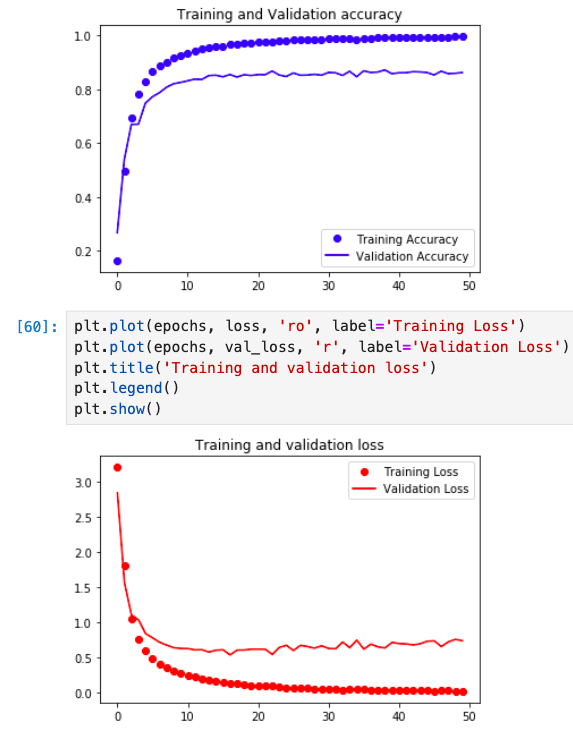
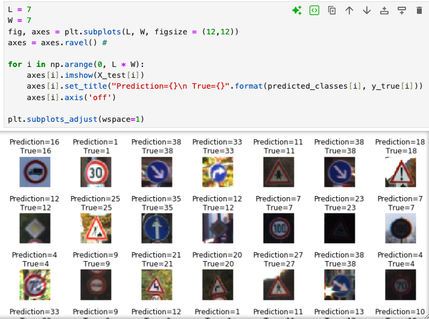
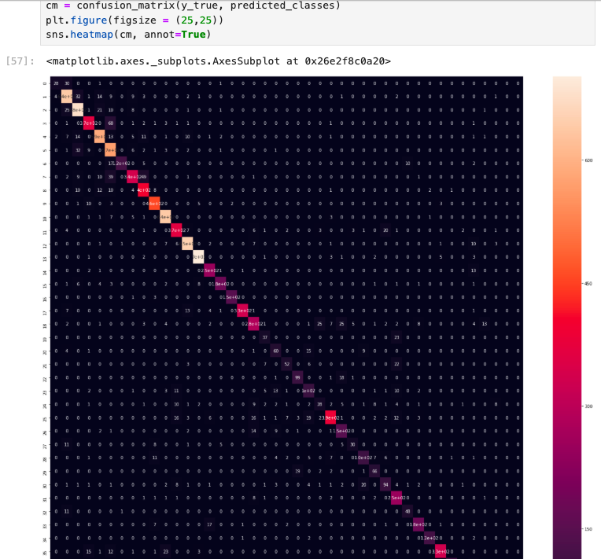

# teach autonomous vehicles how to recognize and respond to signs accurately.

# Training vs. validation accuracy over epochs

**✅ Achieved over 99% accuracy on training and validation data.**

# ✅ Demonstrated effectiveness of LeNet for real-world computer vision tasks like autonomous driving.

# Confusion matrix heatmap 

**✅ Visualized confusion matrix confirming model reliability.** 

# Libraries Used
- import pickle
- import pandas as pd
- import numpy as np
- import seaborn as sns
- import matplotlib.pyplot as plt
- import random
- from keras.models import Sequential
- from keras.layers import Conv2D, AveragePooling2D, Flatten, Dense

#  Training Details
- Batch size: 500
- Epochs: 50
- Optimizer: Adam
- Loss function: Sparse categorical cross-entropy
- Validation split: Separate validation set
  

#  Project Overview
I built and trained a Convolutional Neural Network (CNN) using the LeNet architecture to classify images of traffic signs.
The dataset consists of 43 different classes of traffic signs, representing real-world road conditions — the kind of data used to teach autonomous vehicles how to recognize and respond to signs accurately.
##  Objective
The goal is to train a deep learning model capable of correctly classifying traffic signs into their respective categories based on image data.
##  Model Architecture – LeNet
- My implementation follows the classic LeNet-5 architecture, adapted for grayscale 32×32 pixel images.
  
 **Step 1: First Convolutional Layer**
- Input: 32×32×1
- Filter: 5×5, depth = 6
- Output: 28×28×6
- Activation: ReLU
- Pooling: 2×2 (Output → 14×14×6)
  
**Step 2: Second Convolutional Layer**

- Input: 14×14×6
- Filter: 5×5, depth = 16
- Output: 10×10×16
- Activation: ReLU
- Pooling: 2×2 (Output → 5×5×16)
  
**Step 3: Flattening**

- Input: 5×5×16
- Output: 400
  
**Step 4: Fully Connected Layer**

- Input: 400 → Output: 120
- Activation: ReLU
- Step 5: Fully Connected Layer
- Input: 120 → Output: 84
- Activation: ReLU
Step 6: Output Layer
- Input: 84 → Output: 43 (number of traffic sign classes)
